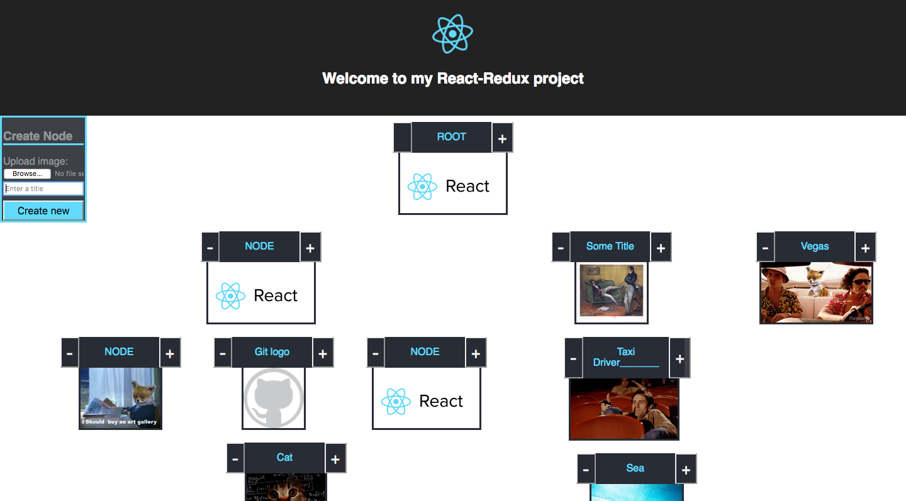

## How to run this app on a local server.

### Requirements:
* Node.js installed.
* Golang installed.
* MySQL Server installed and running.

### Follow these steps to run the app:
* #### Using CLI (i.e. command line), download and access the repository on your computer:
  `git clone https://github.com/bulllittt1/react-redux-project.git && cd react-redux-project`
* #### In the project directory:
    * Install node packages into the project directory:  
      `npm install`
* #### Download needed Go package:
  `go get github.com/rs/cors`

* #### Run the backend:
  `go run server.go`
  * Console will ask $username and $password to access your MySQL server!
* #### Open another console window in the same directory again (~/react-redux-project) and run the frontend; react-app in the development mode:
  `npm start`

* #### Open [http://localhost:3000](http://localhost:3000) in the browser.

The page will reload if you make edits. 
You will also see Redux-logger messages in the browser DevTools console.
